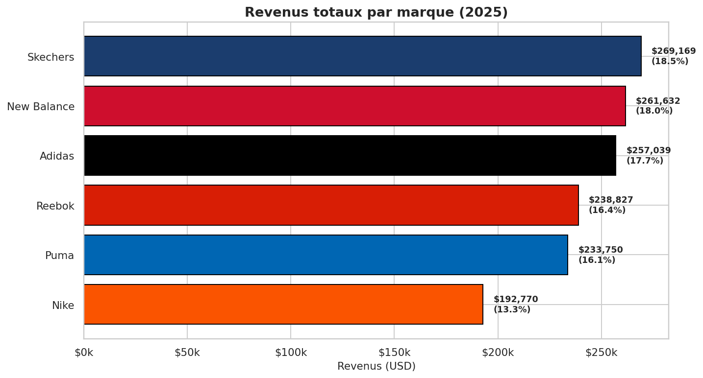
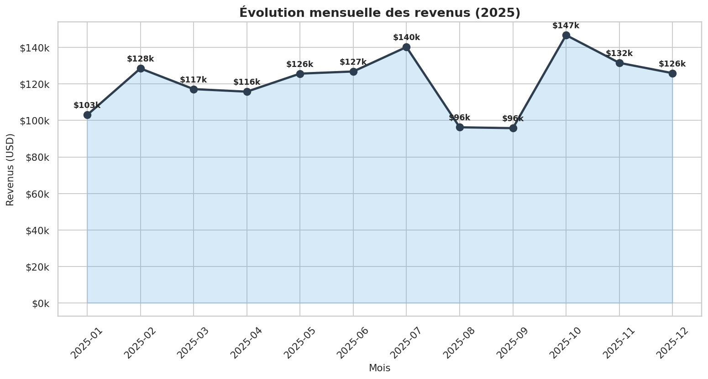
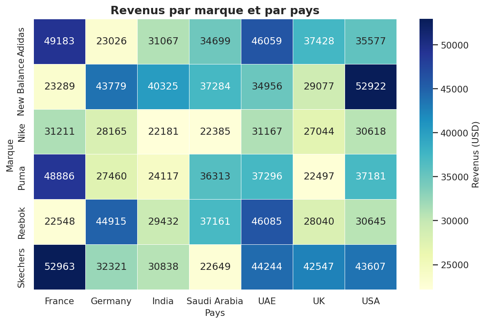

# 👟 Shoes Sales Analysis (2025)

> Analyse des ventes de **1 000 transactions** de chaussures sur l'année 2025, à travers **6 marques**, **7 pays** et **3 canaux de distribution**.


---

## 🎯 Objectif du projet

Construire un pipeline data analytique complet sur des ventes de chaussures pour répondre à des questions business concrètes :

- Quelle **marque domine le marché** en 2025 ?
- Quels **canaux de vente** génèrent le plus de revenus ?
- Quels **pays** sont les plus rentables ?
- Y a-t-il une **saisonnalité** dans les ventes ?
- Quels **types de chaussures** se vendent le mieux et à quel prix ?

Le résultat final est un **dashboard interactif Looker Studio** alimenté par 8 datamarts pré-calculés.

---

## 📊 Aperçu des résultats

### Revenus par marque



> **Skechers** (18.5 %) et **New Balance** (18 %) dominent légèrement, suivis d'**Adidas** (17.7 %). **Nike** ferme la marche à 13.3 %.

### Évolution mensuelle



> Pic en **octobre 2025 ($147k)**, creux en **août-septembre ($96k)**. La saisonnalité est nette.

### Heatmap marque × pays



> Skechers performe surtout en **France ($53k)**, Adidas est fort en **France** et **UAE**, New Balance domine aux **USA ($53k)**.

📁 **10 figures générées** dans [`images/figures/`](images/figures/).

---

## 📁 Structure du projet

```
shoes-sales-analysis/
│
├── data/
│   ├── raw/shoes_sales.csv                  # 1000 transactions brutes
│   ├── processed/shoes_sales_clean.csv      # + features dérivées (Season, Quarter…)
│   ├── datamarts/                           # 🧱 8 tables analytiques
│   │   ├── dm_global_kpis.csv
│   │   ├── dm_brand_performance.csv
│   │   ├── dm_country_performance.csv
│   │   ├── dm_channel_performance.csv
│   │   ├── dm_monthly_trend.csv
│   │   ├── dm_shoe_type_performance.csv
│   │   ├── dm_brand_country_matrix.csv
│   │   └── dm_color_type_matrix.csv
│   └── exports/                             # Exports prêts pour Looker Studio
│
├── notebooks/
│   ├── 01_exploration.ipynb
│   ├── 02_cleaning.ipynb
│   ├── 03_datamarts.ipynb
│   └── 04_visualizations.ipynb
│
├── src/
│   ├── __init__.py
│   ├── data_loader.py
│   ├── preprocessing.py
│   ├── datamarts.py
│   ├── visualizations.py
│   └── utils.py
│
├── sql/
│   ├── create_tables.sql
│   └── queries.sql
│
├── dashboards/looker_studio_guide.md
├── docs/
│   ├── data_dictionary.md
│   ├── datamarts_spec.md
│   └── methodology.md
│
├── images/figures/                          # 10 PNG pré-générés
│
├── build_project.py                         # ⭐ Script maître
├── .gitignore, LICENSE, requirements.txt
└── README.md
```

---

## 📊 Description du dataset

| Variable | Type | Description |
|----------|------|-------------|
| `Sale_ID` | string | Identifiant unique (S1, S2…) |
| `Date` | date | Date de la transaction (2025) |
| `Brand` | string | Nike, Adidas, Puma, Reebok, Skechers, New Balance |
| `Shoe_Type` | string | Boots, Casual, Formal, Running, Sneakers, Sports |
| `Color` | string | Black, Blue, Green, Grey, Red, White |
| `Country` | string | France, Germany, India, Saudi Arabia, UAE, UK, USA |
| `Sales_Channel` | string | Online, Mall, Retail Store |
| `Price_USD` | float | Prix unitaire ($31 - $250) |
| `Units_Sold` | int | Quantité vendue (1-20) |
| `Revenue_USD` | float | Revenue total (Price × Units) |

📄 Détails : [`docs/data_dictionary.md`](docs/data_dictionary.md).

---

## 🧱 Les 8 datamarts

| Datamart | Grain | Cas d'usage |
|----------|-------|-------------|
| `dm_global_kpis` | 1 ligne | Scorecards (revenus totaux, AOV, total unités…) |
| `dm_brand_performance` | par marque | Comparaison marques + market share |
| `dm_country_performance` | par pays | Top pays + market share |
| `dm_channel_performance` | par canal | Online vs Mall vs Retail Store |
| `dm_monthly_trend` | par mois | Saisonnalité, tendances |
| `dm_shoe_type_performance` | par type | Quels produits rapportent le plus |
| `dm_brand_country_matrix` | marque × pays | Matrice pour heatmap |
| `dm_color_type_matrix` | couleur × type | Mix produit |

📄 Spécification complète : [`docs/datamarts_spec.md`](docs/datamarts_spec.md).

---

## 🚀 Installation & utilisation

### 1. Cloner le repo

```bash
git clone https://github.com/<ton-username>/shoes-sales-analysis.git
cd shoes-sales-analysis
```

### 2. Environnement virtuel + dépendances

```bash
python -m venv venv
source venv/bin/activate       # Linux / Mac
# venv\Scripts\activate        # Windows
pip install -r requirements.txt
```

### 3. Générer tous les livrables en une commande

```bash
python build_project.py
```

Ce script :
1. Charge `data/raw/shoes_sales.csv`
2. Nettoie + ajoute des features dérivées (Season, Quarter, Price_Bucket…)
3. Construit les **8 datamarts**
4. Exporte les CSV pour Looker Studio
5. Régénère les **10 figures PNG**

### 4. Explorer avec les notebooks

```bash
jupyter notebook notebooks/
```

---

## 📈 Dashboard Looker Studio

Structure recommandée en **5 pages** :

1. **Executive Overview** — KPIs globaux + évolution mensuelle
2. **Brands** — Comparaison des 6 marques
3. **Geography** — Performance par pays
4. **Channels** — Online vs offline
5. **Products** — Type × couleur × prix

📄 Guide complet : [`dashboards/looker_studio_guide.md`](dashboards/looker_studio_guide.md).

---

## 📌 Principaux insights

- **Revenus totaux 2025** : ~$1.45M sur 1 000 transactions, soit un **AOV de $1 453**
- **Top marque** : Skechers ($269k, 18.5 %)
- **Top pays** : varie selon la marque — France domine pour Skechers et Puma, USA pour New Balance
- **Saisonnalité** : pic en octobre, creux en août-septembre (rentrée + soldes ?)
- **Canal n°1** : à découvrir dans l'analyse — l'écart Online/Mall/Retail est important
- **Prix moyen** : $138, prix médian $139 → distribution équilibrée

---

## 🛠️ Stack technique

- **Python 3.10+** · Pandas · NumPy
- **Matplotlib** · Seaborn pour les figures
- **Jupyter** pour l'exploration
- **Looker Studio** pour le dashboard final
- **BigQuery** (optionnel) pour héberger les données

---

## 📝 Licence

MIT — voir [`LICENSE`](LICENSE).

---

## 👤 Auteur

**Fouad MOUTAIROU**
- GitHub : https://github.com/Fouad-berry
- LinkedIn : https://www.linkedin.com/in/fouad-moutairou-044460273/